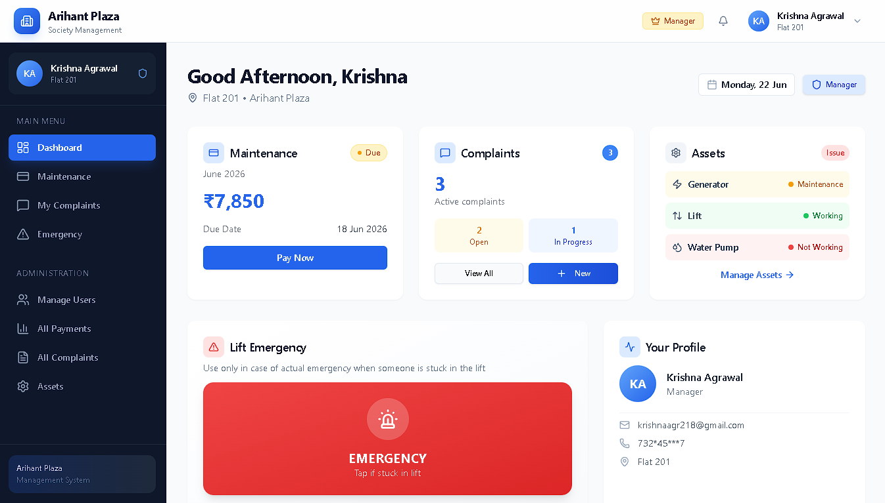
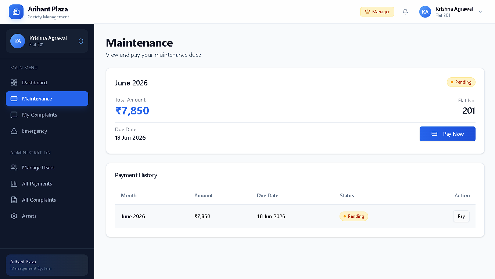
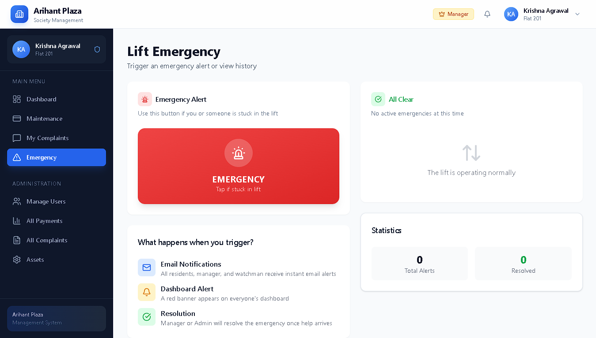
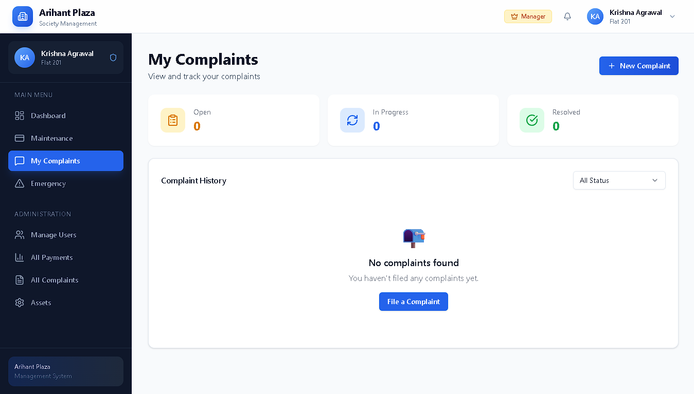
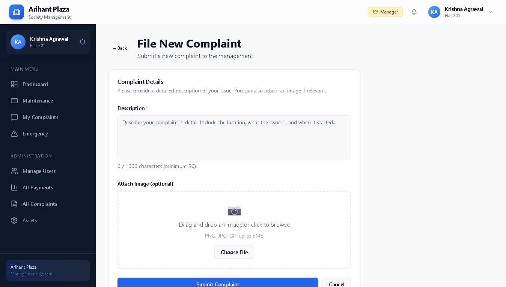
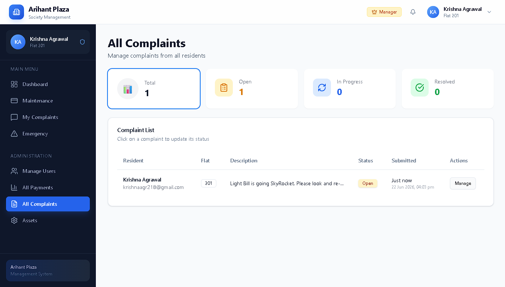
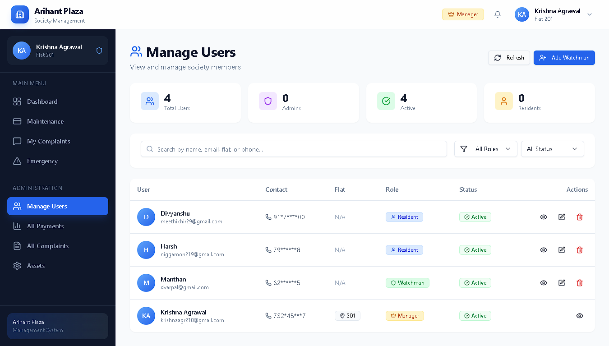
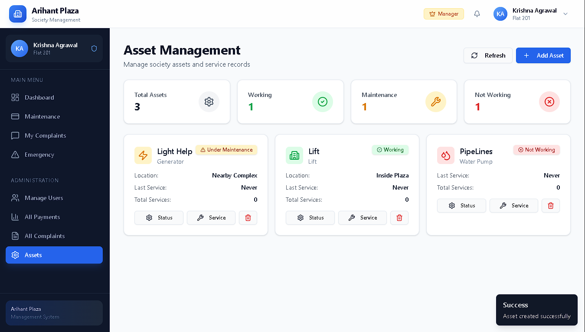
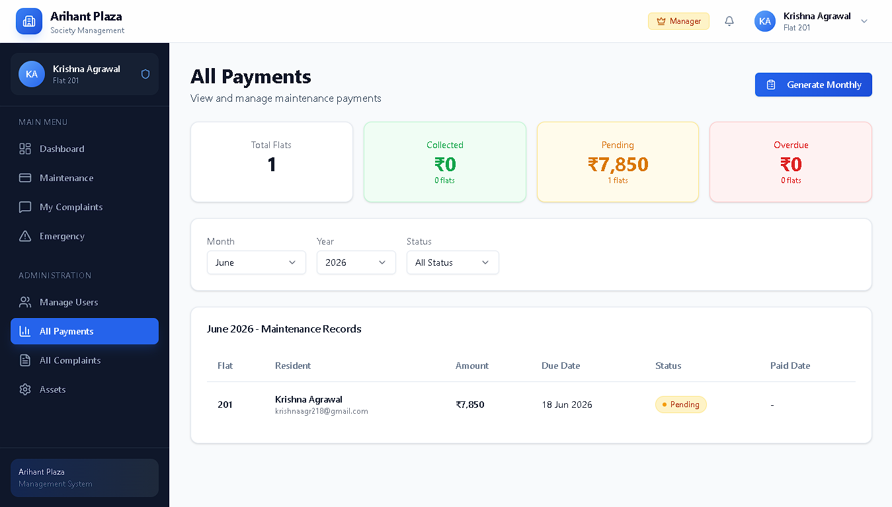

<div align="center">
  
</div>

<h2 align="center">🏢 Arihant Plaza Society Management System</h2>

<p align="center">
  <strong>A comprehensive full-stack society management web application</strong>
</p>

<p align="center">
  <a href="https://Society-Walfares-and-Managment-vert.vercel.app/showcase">
    
  </a>
  <a href="https://Society-Walfares-and-Managment-zjlf.onrender.com">
    
  </a>
  <a href="https://github.com/krishna-Agrawal23/Society-Walfares-and-Managment">
    
  </a>
</p>

<p align="center">
  
  
  
  
  
  
</p>

---

## 📖 Overview

A complete society management solution for **Arihant Plaza** housing society (~40 flats). Built with modern technologies, this system streamlines daily operations including:

- 💳 **Maintenance Collection** - ₹7850/month with Razorpay UPI/Card payments
- 🚨 **Lift Emergency Alerts** - One-click emergency notification to all residents
- 📝 **Complaints Management** - File and track complaints with image uploads
- 🔧 **Asset Tracking** - Monitor lifts, water pumps, generators with service history
- 🚪 **Watchman Portal** - Gate log and visitor management system

## 🖥️ Live Demo

| Platform | URL |
|----------|-----|
| 🌐 **Frontend** | [Society-Walfares-and-Managment-vert.vercel.app](https://society-walfare-managment.vercel.app) |
| 🔗 **Backend API** | [Society-Walfares-and-Managment-zjlf.onrender.com](https://society-walfare-managment.onrender.com) |

## 🛠️ Tech Stack

### Frontend
| Technology | Purpose |
|------------|---------|
| **Next.js 14** | React framework with App Router |
| **TypeScript** | Type-safe development |
| **Tailwind CSS** | Utility-first styling |
| **shadcn/ui** | Accessible UI components |
| **Axios** | HTTP client |

### Backend
| Technology | Purpose |
|------------|---------|
| **Express.js 4.x** | REST API server |
| **Node.js 20.x** | JavaScript runtime |
| **MongoDB Atlas** | NoSQL database |
| **Mongoose 8.x** | ODM for MongoDB |
| **node-cron** | Scheduled jobs |

### Services
| Service | Purpose |
|---------|---------|
| **Razorpay** | Payment gateway (UPI/Cards) |
| **Brevo** | Transactional emails |
| **ImageKit** | Image CDN & uploads |
| **JWT** | Authentication |
| **bcrypt** | Password hashing |

### Deployment
| Platform | Service |
|----------|---------|
| **Vercel** | Frontend hosting |
| **Render** | Backend hosting (Docker) |
| **MongoDB Atlas** | Database hosting |

## 📁 Project Structure

```
Society_Management/
├── client/                    # Next.js 14 Frontend
│   ├── src/
│   │   ├── app/              # App Router pages
│   │   ├── components/       # React components
│   │   ├── context/          # Auth context
│   │   ├── hooks/            # Custom hooks
│   │   ├── lib/              # Utilities
│   │   └── types/            # TypeScript types
│   └── package.json
│
├── server/                    # Express.js Backend
│   ├── config/               # DB, services config
│   ├── controllers/          # Route handlers
│   ├── middleware/           # Auth, error middleware
│   ├── models/               # Mongoose schemas
│   ├── routes/               # API routes
│   ├── services/             # Email, upload services
│   ├── jobs/                 # Cron jobs
│   └── package.json
│
├── .github/                   # GitHub Actions
│   └── workflows/
│       ├── ci.yml            # CI pipeline
│       └── deploy.yml        # Deployment workflow
│
├── docker-compose.yml         # Docker setup
├── ARCHITECTURE.md            # System design
├── CONTRIBUTING.md            # Contribution guide
├── SECURITY.md                # Security policy
└── LICENSE                    # MIT License
```

## **Website OverHaul**
<h3 align="center">🏢 Maintenance & Emergency Page</h3>
<div align="center">
  
  &nbsp;&nbsp;
  
</div>
<h3 align="center">🏢 Complaints & User Managment</h3>
<div align="center">
  
  &nbsp;&nbsp;
  
  &nbsp;&nbsp;
  
  &nbsp;&nbsp;
  
<h3 align="center">🏢 Assests and Payment Management Page </h3>
<div align="center">
  
  &nbsp;&nbsp;
  
</div>

## 🚀 Getting Started

### Prerequisites

- **Node.js** 20.x LTS or higher
- **npm** 10.x or higher
- **MongoDB Atlas** account
- **Razorpay** account
- **Brevo** account
- **ImageKit** account

### Installation

1. **Clone the repository**
   ```bash
   git clone https://github.com/krishna-Agrawal23/Society-Walfare--Managment.git
   cd Society-Walfare-Managment
   ```

2. **Install dependencies**
   ```bash
   # Install client dependencies
   cd client && npm install

   # Install server dependencies
   cd ../server && npm install
   ```

3. **Configure environment variables**

   **Server** (`server/.env.local`):
   ```env
   NODE_ENV=development
   PORT=4000
   MONGODB_URI=mongodb+srv://...
   JWT_SECRET=your_jwt_secret
   JWT_EXPIRES_IN=7d
   RAZORPAY_KEY_ID=rzp_test_xxxx
   RAZORPAY_KEY_SECRET=xxxx
   BREVO_API_KEY=xkeysib-xxxx
   BREVO_SENDER_EMAIL=noreply@domain.com
   BREVO_SENDER_NAME=Arihant Plaza Society
   IMAGEKIT_PUBLIC_KEY=public_xxxx
   IMAGEKIT_PRIVATE_KEY=private_xxxx
   IMAGEKIT_URL_ENDPOINT=https://ik.imagekit.io/xxxx
   CLIENT_URL=http://localhost:3000
   OTP_EXPIRY_MINUTES=10
   ```

   **Client** (`client/.env.local`):
   ```env
   NEXT_PUBLIC_API_URL=http://localhost:4000/api
   NEXT_PUBLIC_RAZORPAY_KEY_ID=rzp_test_xxxx
   NEXT_PUBLIC_IMAGEKIT_PUBLIC_KEY=public_xxxx
   NEXT_PUBLIC_IMAGEKIT_URL_ENDPOINT=https://ik.imagekit.io/xxxx
   ```

4. **Start development servers**
   ```bash
   # Terminal 1 - Backend (Port 4000)
   cd server && npm run dev

   # Terminal 2 - Frontend (Port 3000)
   cd client && npm run dev
   ```

5. **Open in browser**
   - Frontend: [http://localhost:3000](http://localhost:3000)
   - Backend API: [http://localhost:4000](http://localhost:4000)

## 👥 User Roles & Permissions

| Role | Permissions |
|------|-------------|
| **Manager** | Full access, user management, assign admin roles, view all data |
| **Admin** | Manage complaints, emergencies, view payments, asset tracking |
| **Resident** | Pay maintenance, file complaints, trigger emergency, view own data |
| **Watchman** | Gate log management, emergency alerts, mobile-first interface |

## ✨ Features

### 💳 Maintenance Payments
- Automated monthly maintenance generation (₹7850/month)
- ₹100 late fee after 18 days
- Razorpay integration (UPI, Cards, Net Banking)
- Payment reminders via email (Day 1, 10, 16)
- Payment history and receipts

### 🚨 Emergency System
- One-click lift emergency button
- Instant email notification to ALL users
- Real-time emergency status dashboard
- Resolution tracking with timestamps

### 📝 Complaints Management
- File complaints with image upload
- Status tracking (Open → In Progress → Resolved)
- Email notifications on status change
- Admin/Manager resolution panel

### 🔧 Asset Tracking
- Track lifts, water pumps, generators
- Service history logging
- Status monitoring (Working/Under Maintenance/Not Working)
- Technician and service notes

### 🚪 Watchman Portal
- Mobile-first design
- Visitor entry/exit logging
- Vehicle number tracking
- Purpose of visit recording
- Emergency alert access

## 🔗 API Endpoints

### Authentication
| Method | Endpoint | Description |
|--------|----------|-------------|
| POST | `/api/auth/register` | Register new user |
| POST | `/api/auth/login` | User login |
| POST | `/api/auth/logout` | User logout |
| GET | `/api/auth/me` | Get current user |
| POST | `/api/auth/forgot-password` | Send OTP |
| POST | `/api/auth/reset-password` | Reset password |

### Maintenance
| Method | Endpoint | Description |
|--------|----------|-------------|
| GET | `/api/maintenance` | Get maintenance records |
| GET | `/api/maintenance/:id` | Get single record |
| POST | `/api/payment/create-order` | Create Razorpay order |
| POST | `/api/payment/verify` | Verify payment |

### Emergency
| Method | Endpoint | Description |
|--------|----------|-------------|
| POST | `/api/emergency/trigger` | Trigger emergency |
| GET | `/api/emergency/active` | Get active emergencies |
| PUT | `/api/emergency/:id/resolve` | Resolve emergency |

### Complaints
| Method | Endpoint | Description |
|--------|----------|-------------|
| POST | `/api/complaints` | Create complaint |
| GET | `/api/complaints` | Get complaints |
| PUT | `/api/complaints/:id` | Update status |

See [ARCHITECTURE.md](./ARCHITECTURE.md) for complete API documentation.

## 📧 Email Notifications

| Event | Recipients | Timing |
|-------|------------|--------|
| Maintenance Invoice | Resident | 1st of month |
| Payment Reminder | Resident | Day 10, 16 |
| Late Fee Warning | Resident | Day 16 |
| Payment Confirmation | Resident | On payment |
| Emergency Alert | All users | Immediately |
| Emergency Resolved | All users | On resolution |
| Complaint Status | Resident | On change |
| Password Reset OTP | User | On request |

## 🐳 Docker Development

```bash
# Build and start all services
docker-compose up -d

# View logs
docker-compose logs -f

# Stop services
docker-compose down

# Rebuild after changes
docker-compose up -d --build
```

## 🚀 Deployment

### Frontend (Vercel)

1. Push code to GitHub
2. Import project in [Vercel](https://vercel.com)
3. Set Root Directory: `client`
4. Add environment variables
5. Deploy

### Backend (Render)

1. Push code to GitHub
2. Create Web Service in [Render](https://render.com)
3. Set Root Directory: `server`
4. Runtime: Docker
5. Add environment variables
6. Deploy

See detailed deployment guide in the docs.

## 🔐 Security

- JWT authentication with httpOnly cookies
- bcrypt password hashing (10 rounds)
- CORS protection with whitelisted origins
- Helmet security headers
- Input validation with express-validator
- Rate limiting on auth routes
- Environment variable secrets

## 🤝 Contributing

Contributions are welcome! Please read [CONTRIBUTING.md](./CONTRIBUTING.md) for guidelines.

1. Fork the repository
2. Create your feature branch (`git checkout -b feature/AmazingFeature`)
3. Commit your changes (`git commit -m 'Add some AmazingFeature'`)
4. Push to the branch (`git push origin feature/AmazingFeature`)
5. Open a Pull Request

## 📄 License

This project is licensed under the MIT License - see the [LICENSE](./LICENSE) file for details.

## 👨‍💻 Author

**Krishna Agrawal**

- GitHub: [Krishna](https://github.com/krishna-Agrawal23)
- LinkedIn: [Krishna Agrawal](https://linkedin.com/in/krishna-agrawal10)

---

<p align="center">
  Made with ❤️ by Krishna Agrawal
</p>
